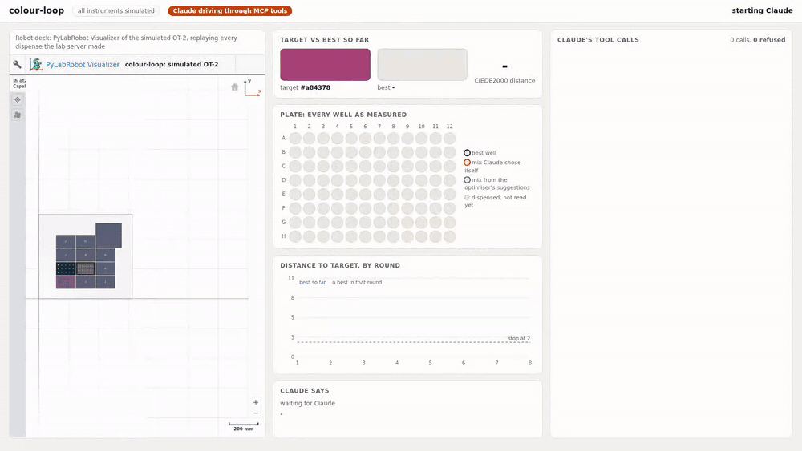
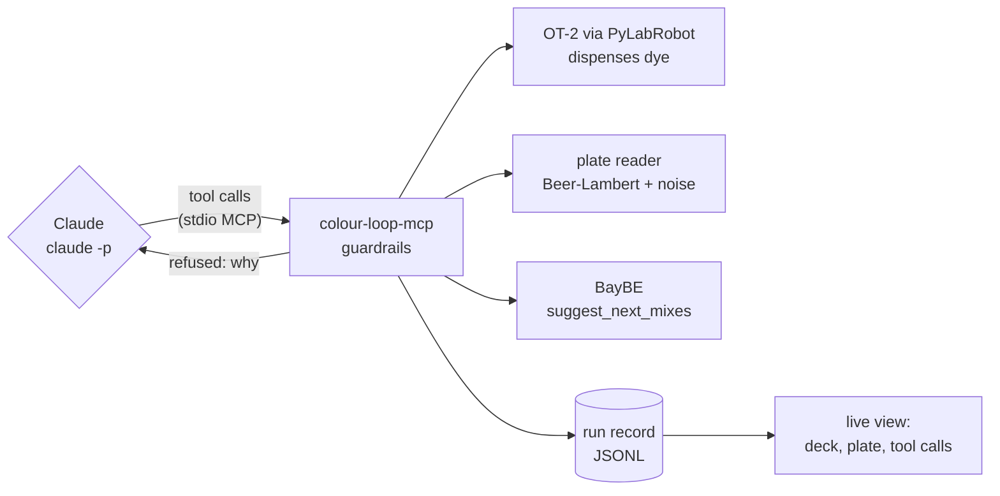
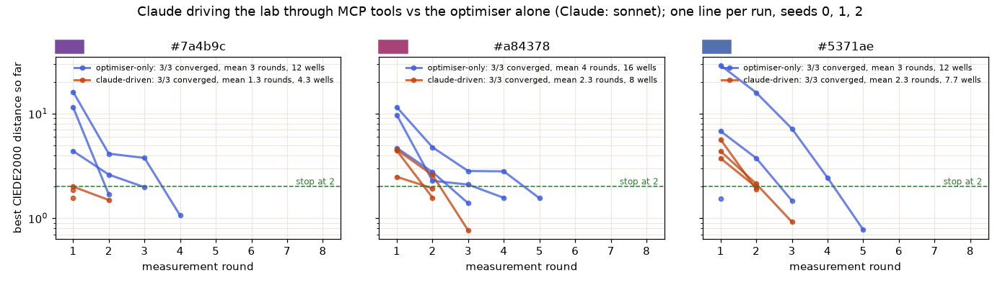
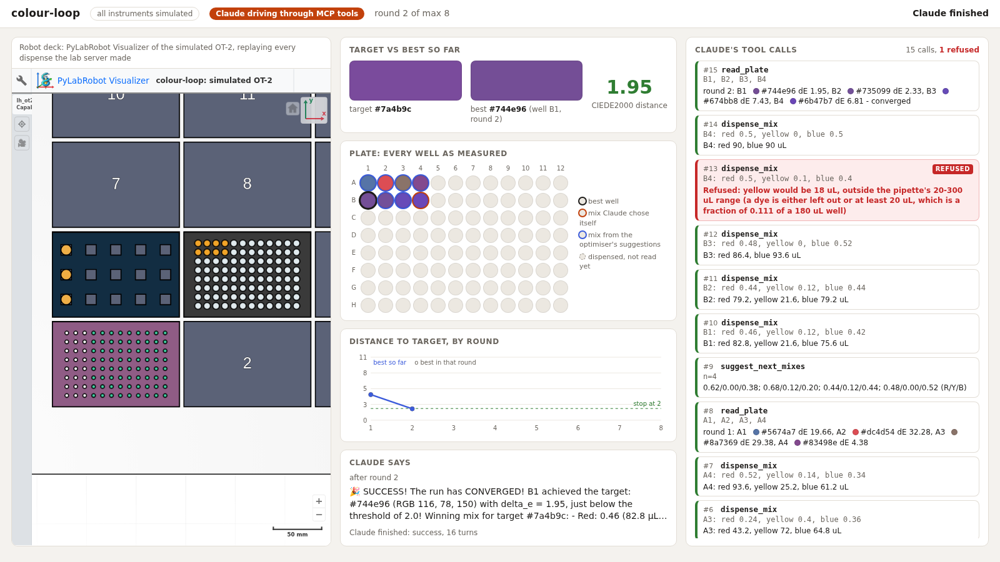
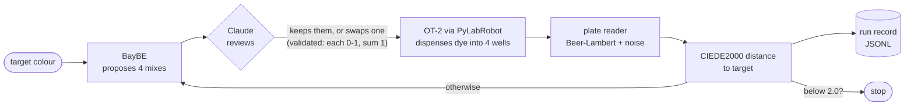

# colour-loop

A tiny self-driving colour lab. A liquid-handling robot mixes red, yellow and blue dye to match a
target colour, a plate reader measures what came out, and something decides the next mixes until a
well is within a just-visible colour difference of the target. That something is either:

- **Claude, driving the lab itself** through six MCP tools (new in 0.2): it checks the deck,
  dispenses mixes, reads the plate, asks the optimiser for ideas when it wants them, and stops when
  it has matched the colour. The tool server enforces lab limits and refuses anything outside them.
- **a Bayesian optimiser closing the loop** (the first version), with Claude reviewing each round
  and allowed to swap one mix.

**The instruments are simulated.** No hardware is involved. See [What is simulated](#what-is-simulated).



The recording above is a real, unedited Claude-driven run ([mp4](docs/agent-demo.mp4),
[its run record](docs/agent-demo-run.jsonl)): target `#a84378`, Claude Sonnet running headless on a
Max plan, 15 tool calls in 19 seconds, converged in 3 rounds and 10 wells to CIEDE2000 0.99.
Left: PyLabRobot's Visualizer showing the simulated OT-2 deck as tips are used and wells fill.
Middle: every measured well, best so far and the distance curve, with what Claude says between rounds.
Right: every tool call Claude makes, as it happens, with its arguments and result; refused calls are red.

### What changed in 0.2

- `colour-loop-mcp`: an MCP tool server (stdio, official `mcp` Python SDK) with six tools over the
  same simulated robot, plate reader and optimiser, and lab guardrails enforced in the server.
- `colour-loop agent`: Claude drives a whole run headless through those tools, watchable live.
- `colour-loop compare`: Claude-driven vs optimiser-only on the same targets, seeds and limits,
  with the [chart and numbers below](#claude-vs-the-optimiser).
- `colour-loop watch`: the live view for any MCP run, including one driven from Claude Code or
  Claude Desktop.
- The live view has a tool-call feed with refusals in red, and shows wells that are dispensed but
  not yet read.

## Run it

Needs Python 3.11 or newer, and for the Claude modes the [Claude Code CLI](https://docs.claude.com/en/docs/claude-code)
logged in (`claude auth status`).

```bash
git clone https://github.com/sanaxr0001-tech/colour-loop && cd colour-loop
python -m venv .venv && source .venv/bin/activate
pip install torch --index-url https://download.pytorch.org/whl/cpu   # optional: CPU-only torch, ~1 GB instead of ~5 GB
pip install -e .

colour-loop agent --target "#7a4b9c" --visual     # Claude drives the lab through the MCP tools
colour-loop run --target "#7a4b9c" --visual       # the optimiser closes the loop, Claude reviews
colour-loop compare                               # both, on the same targets and seeds
```

`--visual` opens the live view in your browser (`http://127.0.0.1:8765/`) and keeps it up after
the run ends; press Ctrl-C to quit (that also stops Claude if it is still running). In the deck
view, the button at the top right of the Visualizer hides its resource tree, and `+` zooms in on
the labware: tips in slot 1, the dye tubes in slot 4, the plate in slot 5.

## Claude drives the lab



`colour-loop agent` starts `claude -p` headless with one MCP server, `colour-loop-mcp`, and nothing
else. Claude gets a short brief (work in rounds, use the tools, stop when converged, say what you
are trying) and the target colour; everything after that is Claude's choice. A round is one
`read_plate` call that measures new wells, the same unit the optimiser loop counts.

### The tools

| tool | what it does |
| --- | --- |
| `get_deck_state()` | target, which wells hold which mix and whether they are read, tips and dye left, the budget used and left, best well so far, converged or not |
| `list_dyes()` | the three dyes, what each looks like, and the volume rules for mixing them |
| `dispense_mix(well, fractions, total_volume_ul=180)` | mixes dye into one empty well (`fractions` like `{"red": 0.48, "yellow": 0.12, "blue": 0.40}`), one fresh tip per dye; returns the volumes dispensed |
| `read_plate(wells)` | measures wells: RGB, hex and CIEDE2000 distance to the target; reading new wells is one round |
| `suggest_next_mixes(n)` | BayBE's next `n` mixes (1-8), from every reading in this run so far; advice only |
| `get_run_record()` | every well with its mix, volumes and reading, the per-round best, the refused calls and why |

One server process is one run. The target is fixed by the server's `--target` start-up argument,
so the agent cannot change the goal. The server also takes `--seed`, `--threshold`, `--max-wells`,
`--max-rounds` and `--record` (see `colour-loop-mcp --help`).

### Guardrails

The tool server enforces these itself, in code; nothing depends on the prompt. A refused call comes
back as a tool error that starts `Refused:` and says which limit and why, so Claude can adjust, and
it is appended to the run record. The live view shows it in red.

| refused when | why |
| --- | --- |
| a fraction is outside 0-1 | not a mix |
| the fractions do not sum to 1 (within 0.01) | not a mix |
| a dye's volume is outside the pipette's 20-300 uL (a dye is either left out or at least 20 uL) | the OT-2 P300 GEN2 cannot move it; at 180 uL that means each dye used is at least 0.12 of the mix |
| the volume would overfill the well (200 uL) | spill |
| the well already holds a mix from this run | no topping up or overwriting |
| the well is not A1-H12 | unknown well |
| the run's well limit is used up (default 32) | per-run budget; 32 dispenses use one 96-tip rack |
| the run's round limit is used up (default 8) | per-run budget; no more dispensing or reading new wells |
| reading a well that is empty | nothing to measure |
| arguments of the wrong type | the SDK rejects them; the server still logs the refusal |

### Use it from Claude Code or Claude Desktop

`colour-loop-mcp` is an ordinary stdio MCP server, so any MCP client can drive the lab. Use the
full path to the script in the virtual environment you installed into (`which colour-loop-mcp`).

Claude Code:

```bash
claude mcp add colour-lab -- /path/to/colour-loop/.venv/bin/colour-loop-mcp \
    --target "#7a4b9c" --record /path/to/colour-loop-runs/claude-code.jsonl
```

Claude Desktop (`claude_desktop_config.json`, then restart the app):

```json
{
  "mcpServers": {
    "colour-lab": {
      "command": "/path/to/colour-loop/.venv/bin/colour-loop-mcp",
      "args": ["--target", "#7a4b9c", "--record", "/path/to/colour-loop-runs/desktop.jsonl"]
    }
  }
}
```

Then ask, for example: "Use the colour-lab tools to match the target colour in as few wells as you
can." The server starts with the client and keeps one run per process, so restart the server (or the
client) for a fresh plate. Without `--record` the record goes to `~/colour-loop-runs/mcp-<time>.jsonl`.

To watch that session live, with the same deck, plate and tool-call feed:

```bash
colour-loop watch /path/to/colour-loop-runs/desktop.jsonl
```

### Headless, on the Max plan

`colour-loop agent` runs `claude -p` with:

- `--mcp-config` naming only `colour-lab` (this package's `colour-loop-mcp`, started over stdio) and
  `--strict-mcp-config`, so no other MCP server from any config is loaded;
- `--tools ""` (no built-in tools: no shell, no files, no web), `--allowedTools` listing exactly the
  six `mcp__colour-lab__*` tools, and `--permission-mode dontAsk`, so anything else is denied;
- `--setting-sources ""` (none of your user, project or local settings, so no hooks),
  `--disable-slash-commands`, `--no-session-persistence`;
- an empty temporary working directory, and a total time budget (`--time-budget`, default 600 s)
  after which Claude and the MCP server it started are stopped.

It uses whatever login the CLI already has, so on a Max plan there is no API key and no per-call
spend. The code never reads or sets `ANTHROPIC_API_KEY`, and removes that one variable from the
child process environment so the CLI cannot fall back to API billing. The run record keeps the
CLI's own report of the session (`"api_key_source": "none"` on a Max login, and the tool list it
was given).

Where the tool calls in the live view come from: the MCP server writes every call to the run record
as it handles it, with the arguments and the result or the refusal. That is what the live view
follows, because it is exactly what the lab did. Claude's `stream-json` output adds what only Claude
knows: what it says between tool calls and its session summary, also appended to the record.

| flag | what it does |
| --- | --- |
| `--model haiku` | Claude model (default `sonnet`) |
| `--effort medium` | Claude effort level (default `low`) |
| `--max-wells 16`, `--max-rounds 4` | tighter budgets, enforced by the server (defaults 32 and 8) |
| `--time-budget 300` | seconds for the whole session (default 600) |
| `--seed 3` | reader-noise and optimiser seed (default 0) |
| `--record path.jsonl` | where the run record goes (default `runs/agent-<time>.jsonl`) |

## Claude vs the optimiser



The default comparison, run on 2026-10-03 with Claude Sonnet at `--effort low` on a Max plan: 3
targets x 3 seeds, 18 runs, about a minute and a half in all ([comparison.json](docs/comparison.json),
[every run record](docs/comparison-runs/)).

| | converged | mean rounds | mean wells | mean time per run | refused calls |
| --- | --- | --- | --- | --- | --- |
| optimiser-only | 9 / 9 | 3.3 (1-5) | 13.3 (4-20) | 0.7 s | 0 |
| Claude-driven | 9 / 9 | 2.0 (1-3) | 6.7 (3-10) | 13.8 s | 0 |

| target | optimiser-only: rounds, wells | Claude-driven: rounds, wells |
| --- | --- | --- |
| `#7a4b9c` | 3, 12 | 1.3, 4.3 |
| `#a84378` | 4, 16 | 2.3, 8 |
| `#5371ae` | 3, 12 | 2.3, 7.7 |

What this shows, and what it does not: Claude reached the threshold in fewer rounds and about half
the wells, by reasoning about colour (too red, add blue) instead of exploring the triangle from
scratch. It did not ask for the optimiser's suggestions in any of these runs. Each Claude run took
6 to 11 tool calls and 10 to 18 seconds of wall time, against well under 2 seconds for the optimiser.
These are three reachable targets and three seeds, not a benchmark. No call was refused in these
runs; a refusal from an earlier Claude Haiku run looks like this in the live view
([its run record](docs/refusal-run.jsonl)):



```bash
colour-loop compare --targets "#7a4b9c,#a84378,#5371ae" --seeds 0,1,2 --parallel 3   # the defaults
```

Both modes get the same targets, seeds, threshold (2.0) and budget (32 wells, 8 rounds), and the
same pipette rule: the optimiser-only loop searches only mixes whose dyes are each left out or at
least 20 uL, so it never proposes anything the server would refuse. The optimiser proposes 4 mixes a
round; Claude decides how many. The same seed gives the same reader noise, so the same mix reads the
same in both. The Claude runs go in parallel (`--parallel`), so the default comparison takes a few
minutes. It writes `comparison.json` (every run, with its best-so-far curve, wells, rounds,
refusals and time, plus per-mode means) and `comparison.png` to `--out` (default `docs/`), and the
run records to `runs/compare-<time>/`. `--no-claude` runs only the optimiser half.

## The optimiser loop




The recording above is a real, unedited run of the first version ([mp4](docs/demo.mp4),
[its run record](docs/demo-run.jsonl)): target `#7a4b9c`, Claude reviewing headless, converged in 3
rounds to CIEDE2000 0.55.

Each round:

1. **Propose.** [BayBE](https://github.com/emdgroup/baybe) suggests 4 mixes (fractions of red,
   yellow and blue that sum to 1) from everything measured so far. The search space is the whole
   mixing triangle on a 2 % grid (1326 mixes).
2. **Review.** Claude gets a compact table of the results so far plus the 4 proposals, writes a
   two-sentence note, and may replace at most one proposal. Its answer is untrusted: the
   replacement must name a real proposal and have fractions each within 0-1 that sum to 1, or it is
   ignored and logged.
3. **Mix.** The robot takes a fresh tip per dye, pipettes each dye into 4 empty wells of a 96-well
   plate, and discards the tip. Every well is made up to 180 uL.
4. **Measure.** The plate reader turns each well's dye volumes into an RGB reading.
5. **Score and record.** The distance from each reading to the target is CIEDE2000 (about 1 is
   the smallest difference a person can see). Everything goes into a JSONL record. The loop stops
   when a well is within 2.0 of the target, or after 10 rounds.

`colour-loop run` flags:

| flag | what it does |
| --- | --- |
| `--no-claude` | optimiser only; Claude is never called |
| `--model haiku` | Claude model for the headless call (default `sonnet`) |
| `--threshold 1.0` | stop at a tighter colour match (default 2.0) |
| `--max-rounds 15` | allow more rounds (default 10; the plate fits 24 rounds of 4) |
| `--seed 3` | different optimiser and reader-noise seed (default 0) |
| `--record path.jsonl` | where to write the run record (default `runs/run-<time>.jsonl`) |
| `--step-delay 0.5` | slow the robot down to watch it (default 0.25 s per step with `--visual`) |

Without `--visual`, a run prints one line per round and takes a few seconds optimiser-only, or
about 10 seconds per round with Claude.

Not every colour can be made: the dye fractions always sum to 1, so very light or very dark targets
are outside what these three dyes can reach. The run warns at the start when that is the case.

Each round's review calls `claude -p` with structured JSON output, `--effort low`, no tools, no MCP
servers, none of your user or project settings (so no hooks), from an empty working directory, with
a 90 s timeout, under the same no-API-key rule as above. If `claude` is not installed or not logged
in, the run says so and continues optimiser-only. In the recorded run each call took 7 to 9 seconds
with Sonnet, CLI start-up included.

## The run records

`colour-loop run` writes one JSON object per round:

```json
{"round": 1, "target": "#7a4b9c",
 "proposals": [[0.48, 0.46, 0.06], [0.48, 0.42, 0.1], ...],
 "claude": {"asked": true, "note": "First round, so there is no data yet. ...",
            "override": {"index": 0, "fractions": [0.4, 0.14, 0.46], "why": "Target #7a4b9c is purple, ..."},
            "rejected_override": null, "error": null, "seconds": 8.87},
 "wells": [{"round": 1, "well": "A1", "decided_by": "claude",
            "proposed_fractions": [0.48, 0.46, 0.06], "fractions": [0.4, 0.14, 0.46],
            "dispensed_ul": {"red": 72.0, "yellow": 25.2, "blue": 82.8},
            "rgb": [114, 85, 153], "hex": "#725599", "delta_e": 3.886}, ...],
 "round_best_delta_e": 3.886, "best_so_far": {...}, "converged": false}
```

`decided_by` says whether BayBE or Claude chose each well's mix.

`colour-loop-mcp` (and so `colour-loop agent`) writes one event per line, as it happens:

```json
{"type": "session", "target": "#7a4b9c", "threshold": 2.0, "seed": 0, "limits": {"max_wells": 32, "max_rounds": 8, "pipette_ul": [20.0, 300.0], ...}}
{"type": "claude", "event": "init", "model": "claude-sonnet-...", "tools": ["mcp__colour-lab__dispense_mix", ...], "api_key_source": "none", ...}
{"type": "call", "seq": 3, "tool": "dispense_mix", "args": {"well": "A1", "fractions": {"red": 0.44, "yellow": 0.12, "blue": 0.44}},
 "ok": true, "result": {"well": "A1", "dispensed_ul": {"red": 79.2, "yellow": 21.6, "blue": 79.2}, ...}}
{"type": "call", "seq": 9, "tool": "dispense_mix", "args": {...}, "ok": false, "refused": true,
 "reason": "yellow would be 18 uL, outside the pipette's 20-300 uL range ..."}
{"type": "round", "round": 1, "wells": [{"well": "A1", "rgb": [...], "hex": "#...", "delta_e": 4.2, "decided_by": "claude", ...}],
 "round_best_delta_e": 4.2, "best_so_far": {...}, "converged": false}
{"type": "claude", "event": "text", "text": "Round 2: more blue, since every well so far reads too red."}
{"type": "claude", "event": "result", "subtype": "success", "num_turns": 31, "duration_ms": 98000, ...}
```

In agent runs `decided_by` is `claude` for a mix Claude chose itself and `suggestion` for one it
took from `suggest_next_mixes`.

## What is simulated

Everything physical.

- **The robot** is PyLabRobot's `LiquidHandler` with its `OpentronsOT2Simulator` backend on an
  `OTDeck`, using real Opentrons labware definitions (300 uL tip rack, 15 x 15 mL tube rack, NEST
  96-well flat plate, vendored in `src/colour_loop/labware/`). The simulator accepts every command
  and does PyLabRobot's tip and volume bookkeeping, so tips are consumed and wells fill exactly as
  the protocol says, but nothing moves. The simulator itself does not enforce the P300's 20-300 uL
  range; the MCP tool server does, and the comparison's optimiser stays inside it. `colour-loop run`
  keeps the first version's behaviour and may pipette a few uL, which on a real OT-2 would need a P20.
- **The plate reader** is `src/colour_loop/physics.py`, under 100 lines. Each dye absorbs light per
  colour channel by Beer-Lambert (absorbance adds up in proportion to each dye's fraction of the
  well), the transmitted light is the reading, and seeded Gaussian noise (SD 1.5 out of 255) is
  added. The absorbance coefficients are invented but plausible, not measured from real dyes, and
  wells are assumed perfectly mixed. Claude is told only what each dye looks like, not the numbers.
- **The deck view** is PyLabRobot's own browser Visualizer, which renders the OT-2 deck directly.
  It colours liquid by volume in one colour; the measured colour of each well is shown in the panel
  next to it. In agent mode it is a second simulated OT-2 in the viewer, replaying every dispense
  from the run record, so the view never slows the lab down.

What is real: the optimiser (BayBE), the colour science (CIEDE2000, checked against the published
reference values), the MCP server and its guardrails, the closed-loop orchestration, the run
records, and the Claude calls.

## Tests

```bash
pip install -e '.[test]'
pytest
```

The tests cover the colour physics and CIEDE2000, the robot's volume bookkeeping, the bounds checks
on Claude's overrides, the six MCP tools through the SDK's in-process client, one test for each
guardrail (each proves the call is refused, nothing is dispensed, and the refusal is in the run
record), the agent mode end to end against a stand-in `claude` executable that drives the real
stdio server (including that only the lab's tools are allowed, the empty working directory, the
missing API key and the time budget), a complete optimiser-only run, and an optimiser-only
comparison with a fixed seed. GitHub Actions runs them on every push, without Claude.

## Recording the demos

```bash
pip install -e '.[video]' && playwright install chromium
python scripts/record_demo.py --agent  # writes docs/agent-demo.mp4, .gif and -run.jsonl
python scripts/record_demo.py          # the optimiser loop: docs/demo.mp4, .gif and demo-run.jsonl
```

It starts a `--visual` run, records the live view in headless Chromium with Playwright, and converts
the recording with ffmpeg.

## Layout

```
src/colour_loop/
  physics.py       simulated plate reader (Beer-Lambert + noise)
  colour.py        sRGB -> CIELAB, CIEDE2000
  labware.py       OT-2 deck from vendored Opentrons labware definitions
  robot.py         PyLabRobot LiquidHandler + OT-2 simulator: dispense mixes into wells
  optimiser.py     BayBE campaign over the mixing triangle
  claude_layer.py  headless Claude review call, response validation
  loop.py          the optimiser loop and its JSONL record
  mcp_server.py    `colour-loop-mcp`: the six tools, the guardrails, the MCP run record
  agent.py         `colour-loop agent`: headless Claude on the MCP server; follows a record into the live view
  compare.py       `colour-loop compare`: both modes, comparison.json and comparison.png
  web.py, static/  the live view
  cli.py           `colour-loop run | agent | compare | watch`
```

## Next steps

Left out on purpose:

- **More instruments**, such as a real or simulated spectrophotometer reading full spectra, a
  shaker, or a second liquid handler.
- **A scheduler with error recovery**: queued experiments, retries, and handling of failed
  dispenses, empty tubes and a full plate.
- **SiLA 2** interfaces, so the same loop can talk to standard lab instruments.
