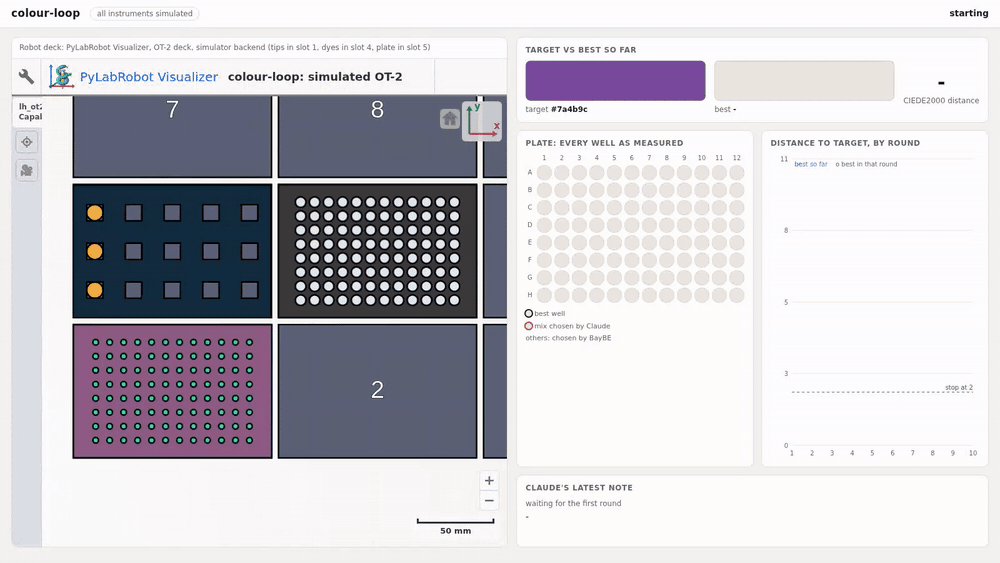

# colour-loop

A tiny self-driving colour lab. A liquid-handling robot mixes red, yellow and blue dye to match a
target colour, a plate reader measures what came out, a Bayesian optimiser picks the next mixes,
and Claude reads each round and may swap one mix. It closes the loop on its own and usually lands
within a just-visible colour difference of the target in 3 to 5 rounds.

**The instruments are simulated.** No hardware is involved. See [What is simulated](#what-is-simulated).



The recording above is a real, unedited run ([mp4](docs/demo.mp4), [its run record](docs/demo-run.jsonl)):
target `#7a4b9c`, Claude running headless, converged in 3 rounds to CIEDE2000 0.55.
Left: PyLabRobot's Visualizer showing the simulated OT-2 deck as tips are used and wells fill.
Right: the live panel with every measured well, best so far, the distance curve and Claude's note.

## The loop


Each round:

1. **Propose.** [BayBE](https://github.com/emdgroup/baybe) suggests 4 mixes (fractions of red,
   yellow and blue that sum to 1) from everything measured so far. The search space is the whole
   mixing triangle on a 2 % grid (1326 mixes).
2. **Review.** Claude gets a compact table of the results so far plus the 4 proposals, writes a
   two-sentence note, and may replace at most one proposal. Its answer is untrusted: the
   replacement must name a real proposal and have fractions each within 0-1 that sum to 1, or it is
   ignored and logged.
3. **Mix.** The robot takes a fresh tip per dye, pipettes each dye into 4 empty wells of a 96-well
   plate, and discards the tip. Every well is made up to 180 uL.
4. **Measure.** The plate reader turns each well's dye volumes into an RGB reading.
5. **Score and record.** The distance from each reading to the target is CIEDE2000 (about 1 is
   the smallest difference a person can see). Everything goes into a JSONL record. The loop stops
   when a well is within 2.0 of the target, or after 10 rounds.

## Run it

Needs Python 3.11 or newer.

```bash
git clone https://github.com/sanaxr0001-tech/colour-loop && cd colour-loop
python -m venv .venv && source .venv/bin/activate
pip install torch --index-url https://download.pytorch.org/whl/cpu   # optional: CPU-only torch, ~1 GB instead of ~5 GB
pip install -e .

colour-loop run --target "#7a4b9c" --visual
```

`--visual` opens the live view in your browser (`http://127.0.0.1:8765/`) and keeps it up after
the run ends; press Ctrl-C to quit. In the deck view, the button at the top right of the Visualizer
hides its resource tree, and `+` zooms in on the labware: tips in slot 1, the dye tubes in slot 4,
the plate in slot 5.

Other useful flags:

| flag | what it does |
| --- | --- |
| `--no-claude` | optimiser only; Claude is never called |
| `--model haiku` | Claude model for the headless call (default `sonnet`) |
| `--threshold 1.0` | stop at a tighter colour match (default 2.0) |
| `--max-rounds 15` | allow more rounds (default 10; the plate fits 24 rounds of 4) |
| `--seed 3` | different optimiser and reader-noise seed (default 0) |
| `--record path.jsonl` | where to write the run record (default `runs/run-<time>.jsonl`) |
| `--step-delay 0.5` | slow the robot down to watch it (default 0.25 s per step with `--visual`) |

Without `--visual`, a run prints one line per round and takes a few seconds optimiser-only, or
about 10 seconds per round with Claude.

Not every colour can be made: the dye fractions always sum to 1, so very light or very dark targets
are outside what these three dyes can reach. The run warns at the start when that is the case.

## Claude, headless

Each round calls `claude -p` (the Claude Code CLI) with structured JSON output, `--effort low`, no
tools, no MCP servers, none of your user or project settings (so no hooks), from an empty working
directory, with a 90 s timeout. It uses whatever login the CLI
already has, so on a Max plan there is no API key and no per-call spend. The code never reads or
sets `ANTHROPIC_API_KEY`, and removes that one variable from the child process environment so the
CLI cannot fall back to API billing. If `claude` is not installed or not logged in, the run says so
and continues optimiser-only. `--no-claude` forces that.

In the recorded run each call took 7 to 9 seconds with Sonnet, CLI start-up included.

## The run record

One JSON object per round, appended as the run goes:

```json
{"round": 1, "target": "#7a4b9c",
 "proposals": [[0.48, 0.46, 0.06], [0.48, 0.42, 0.1], ...],
 "claude": {"asked": true, "note": "First round, so there is no data yet. ...",
            "override": {"index": 0, "fractions": [0.4, 0.14, 0.46], "why": "Target #7a4b9c is purple, ..."},
            "rejected_override": null, "error": null, "seconds": 8.87},
 "wells": [{"round": 1, "well": "A1", "decided_by": "claude",
            "proposed_fractions": [0.48, 0.46, 0.06], "fractions": [0.4, 0.14, 0.46],
            "dispensed_ul": {"red": 72.0, "yellow": 25.2, "blue": 82.8},
            "rgb": [114, 85, 153], "hex": "#725599", "delta_e": 3.886}, ...],
 "round_best_delta_e": 3.886, "best_so_far": {...}, "converged": false}
```

`decided_by` says whether BayBE or Claude chose each well's mix.

## What is simulated

Everything physical.

- **The robot** is PyLabRobot's `LiquidHandler` with its `OpentronsOT2Simulator` backend on an
  `OTDeck`, using real Opentrons labware definitions (300 uL tip rack, 15 x 15 mL tube rack, NEST
  96-well flat plate, vendored in `src/colour_loop/labware/`). The simulator accepts every command
  and does PyLabRobot's tip and volume bookkeeping, so tips are consumed and wells fill exactly as
  the protocol says, but nothing moves. The simulated P300 does not enforce the real pipette's
  20 uL minimum; on a real OT-2, small dye volumes would go through a P20.
- **The plate reader** is `src/colour_loop/physics.py`, under 100 lines. Each dye absorbs light per
  colour channel by Beer-Lambert (absorbance adds up in proportion to each dye's fraction of the
  well), the transmitted light is the reading, and seeded Gaussian noise (SD 1.5 out of 255) is
  added. The absorbance coefficients are invented but plausible, not measured from real dyes, and
  wells are assumed perfectly mixed.
- **The deck view** is PyLabRobot's own browser Visualizer, which renders the OT-2 deck directly.
  It colours liquid by volume in one colour; the measured colour of each well is shown in the panel
  next to it.

What is real: the optimiser (BayBE), the colour science (CIEDE2000, checked against the published
reference values), the closed-loop orchestration, the run record, and the Claude calls.

## Tests

```bash
pip install -e '.[test]'
pytest
```

The tests cover the colour physics and CIEDE2000, the bounds checks on Claude's overrides (and the
headless call itself, against a stand-in `claude` executable), the robot's volume bookkeeping, and a
complete optimiser-only run with a fixed seed. GitHub Actions runs them on every push, without
Claude.

## Recording the demo

```bash
pip install -e '.[video]' && playwright install chromium
python scripts/record_demo.py          # writes docs/demo.mp4, docs/demo.gif, docs/demo-run.jsonl
```

It starts a `--visual` run, records the live view in headless Chromium with Playwright, and converts
the recording with ffmpeg.

## Layout

```
src/colour_loop/
  physics.py       simulated plate reader (Beer-Lambert + noise)
  colour.py        sRGB -> CIELAB, CIEDE2000
  labware.py       OT-2 deck from vendored Opentrons labware definitions
  robot.py         PyLabRobot LiquidHandler + OT-2 simulator: dispense mixes into wells
  optimiser.py     BayBE campaign over the mixing triangle
  claude_layer.py  headless Claude call, response validation
  loop.py          the closed loop and the JSONL record
  web.py, static/  the live view
  cli.py           `colour-loop run`
```

## Next steps

Left out on purpose for this first version:

- **MCP tools** so an agent can drive the instruments and query the run record directly, instead of
  only reviewing proposals.
- **More instruments**, such as a real or simulated spectrophotometer reading full spectra, a
  shaker, or a second liquid handler.
- **A scheduler with error recovery**: queued experiments, retries, and handling of failed
  dispenses, empty tubes and a full plate.
- **SiLA 2** interfaces, so the same loop can talk to standard lab instruments.
